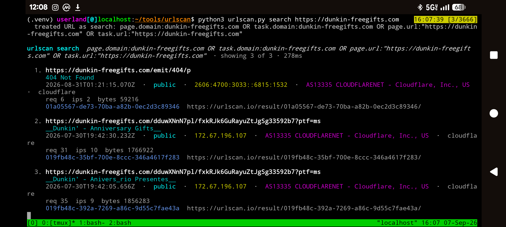

# urlscan.py

Command-line client for the [urlscan.io](https://urlscan.io) API.

Search historical website scans, submit new ones, poll results, grab
screenshots and DOM snapshots, and check your remaining quota — all from a
single Python 3 script with colored output.

No third-party packages. Copy `urlscan.py` onto a box with Python 3.10+ and
run it.



```text
urlscan search  page.domain:example.com AND date:>now-7d · showing 3 of 3286

  1. https://www.example.com/
     Example Domain
     2026-09-07T15:24:10Z  ·  public  ·  172.66.147.243  ·  AS13335 CLOUDFLARENET
     01a07c78-25e6-7082-93a2-2e01f86c9378
```

## Features

- **search** historical scans with the same Elasticsearch query language as the urlscan search box
- **URL auto-rewrite** — paste `https://evil.tld` and it becomes a valid `page.domain:` / `task.url:` query
- **scan** a URL with visibility, country, tags, custom User-Agent, and Referer
- **wait / poll** until a scan finishes (respects urlscan's "wait \~10s, then poll" guidance)
- **result** summary: page metadata, verdict badge, stats, contacted indicators
- **screenshot** and **dom** downloads
- **quotas** table (minute / hour / day remaining, color-coded)
- **whoami** for the account attached to your API key
- **fields** cheat-sheet of useful search fields
- `--json` and `--save FILE` for tooling / pipelines
- rate-limit headers printed after each call; HTTP 429 tells you when to retry
- ANSI color that disables itself when stdout is not a TTY, with `--no-color` and `NO_COLOR`

## Install

```bash
git clone https://github.com/glask1d/urlscan.git
cd urlscan
chmod +x urlscan.py
python3 urlscan.py --help
```

Or drop the script on your `PATH`:

```bash
install -m 0755 urlscan.py \~/.local/bin/urlscan
```

Python **3.10+**. There is nothing in `requirements.txt` to install.

## Authentication

Get a free key: [sign up](https://urlscan.io/user/signup) → Settings & API → New API key.

Supply it in any of these ways (first match wins):

| Source | Example |
| --- | --- |
| Flag | `python3 urlscan.py --api-key YOUR_KEY search domain:example.com` |
| Environment | `export URLSCAN_API_KEY=YOUR_KEY` |
| Config file | first line of `\~/.config/urlscan/api_key` or `\~/.urlscan_api_key` |

Search and quotas still work without a key on a smaller per-IP budget. Submitting scans has always required a key. Fetching **results** and **DOM snapshots** requires a key as of May 2026.

Prefer the environment variable or config file so the key does not land in shell history.

## Usage

```text
python3 urlscan.py [--api-key KEY] [--json] [--no-color] [--save FILE] [--timeout SEC]
                   {search,scan,result,screenshot,dom,quotas,whoami,fields} ...
```

Global flags come **before** the subcommand.

### Search existing scans

```bash
python3 urlscan.py search 'page.domain:example.com AND date:>now-7d'
python3 urlscan.py search https://example.com --size 25
python3 urlscan.py search 'domain:paypal.com AND country:ru' --json --save hits.json
```

Paginate with the cursor printed at the bottom of a result page:

```bash
python3 urlscan.py search 'page.domain:example.com' --after '1788793609074,01a07c68-2f36-774f-b9fd-61d733d49154'
```

Pro datasources (hostnames, incidents, certificates, …):

```bash
python3 urlscan.py search 'domain:example.com' --datasource hostnames
```

### Submit a scan

```bash
python3 urlscan.py scan https://example.com
python3 urlscan.py scan https://example.com --visibility unlisted --tag phishing --wait
python3 urlscan.py scan https://example.com --country us --user-agent 'Mozilla/5.0 ...'
```

`--wait` sleeps \~10 seconds, then polls every 3 seconds until the result is ready (override with `--wait-timeout`, `--initial-delay`, `--interval`).

Visibility:

| Value | Who can see it |
| --- | --- |
| `public` | Front page and public search |
| `unlisted` | Not listed publicly; use for suspected-malicious / PII-adjacent URLs |
| `private` | You (and your team) only |

### Fetch a result by UUID

```bash
python3 urlscan.py result 01a07c78-25e6-7082-93a2-2e01f86c9378
python3 urlscan.py result 01a07c78-25e6-7082-93a2-2e01f86c9378 --wait --save result.json
```

A `404` means the scan is still running — pass `--wait` or retry in a few seconds. A `410` means urlscan deleted the result.

### Screenshot and DOM

```bash
python3 urlscan.py screenshot 01a07c78-25e6-7082-93a2-2e01f86c9378 -o shot.png
python3 urlscan.py dom 01a07c78-25e6-7082-93a2-2e01f86c9378 -o page.html
```

### Quotas and identity

```bash
python3 urlscan.py quotas
python3 urlscan.py whoami
```

### Search field cheat-sheet

```bash
python3 urlscan.py fields
```

## Search syntax

urlscan uses an [Elasticsearch query string](https://docs.urlscan.io/pages/search-general). Default operator is `AND`. Field names are case-sensitive.

Useful fields:

| Query | Meaning |
| --- | --- |
| `page.domain:example.com` | Final page domain (includes subdomains) |
| `domain:example.com` | Any contacted or tasked domain |
| `page.ip:1.2.3.4` | Final page IP |
| `ip:1.2.3.0\/24` | Contacted IP / CIDR (`/` must be escaped) |
| `asn:AS13335` | Contacted ASN |
| `hash:<sha256>` | Resource hash |
| `server:nginx` | HTTP `Server` banner |
| `country:us` | Page country (ISO-3166 alpha-2) |
| `task.url:"https://..."` | Originally submitted URL |
| `task.uuid:<uuid>` | Exact scan id |
| `task.visibility:public` | `public`, `unlisted`, or `private` |
| `task.tags:phishing` | Submitter tags |
| `date:>now-7d` | Relative window — **always prefer a date filter** |
| `date:[2026-01-01 TO 2026-02-01]` | Absolute range |
| `stats.uniqIPs:>10` | Numeric threshold |
| `verdicts.malicious:true` | Has a malicious verdict (plan-dependent) |

Combine with `AND` / `OR` / `NOT` and parentheses. Escape reserved characters:

```text
+ - = && || > < ! ( ) { } [ ] ^ " \~ * ? : \ /
```

Pasting a raw `https://…` URL is rewritten for you. For everything else, quote the query so the shell does not eat `*`, `>`, or `|`.

Full field list: [Website Scans Search Reference](https://docs.urlscan.io/pages/search-api-reference).

## JSON / scripting

Every command that talks to the API accepts `--json`. Pair it with `--save` to keep a copy:

```bash
python3 urlscan.py --json --save out.json search 'page.domain:example.com' --size 100
python3 urlscan.py --json quotas | jq '.limits.search.day'
```

Exit status is `0` on success, `1` on API/usage errors, `130` on Ctrl-C.

## Rate limits

urlscan applies separate minute / hour / day windows per action (`search`, `public`, `unlisted`, `private`, `retrieve`, …). Successful `HTTP 200` responses count; errors generally do not.

The client prints the tightest remaining window after each call and surfaces `Retry-After`-style info on `HTTP 429`. Check the full picture with `quotas`.

Docs: [API rate limits](https://docs.urlscan.io/pages/api-rate-limits), [quotas endpoint](https://urlscan.io/api/v1/quotas).

## Tips from urlscan

- Search before you submit. A prior sighting is free; a new scan spends quota and may publish the URL.
- Bound searches with `date:>now-7d` (or similar) so you do not burn quota on unbounded queries.
- Poll results with an initial pause, then a short interval — that is what `--wait` does.
- Use `unlisted` or `private` when a URL might contain PII.
- Do not scrape or mirror the dataset; ask urlscan for bulk access.

## API coverage

| Endpoint | Command |
| --- | --- |
| `GET /api/v1/search/` | `search` |
| `POST /api/v1/scan/` | `scan` |
| `GET /api/v1/result/{uuid}/` | `result`, `scan --wait` |
| `GET /screenshots/{uuid}.png` | `screenshot` |
| `GET /dom/{uuid}/` | `dom` |
| `GET /api/v1/quotas` | `quotas` |
| `GET /user/username` | `whoami` |

Header used: `API-Key`.

## Development

```bash
python3 -m py_compile urlscan.py
python3 urlscan.py fields
python3 urlscan.py search 'page.domain:example.com AND date:>now-1d' --size 3
```

The script is a single file on purpose. Keep it that way unless you have a good reason not to.

## License

MIT. urlscan.io is a trademark of the urlscan project; this client is unofficial.
